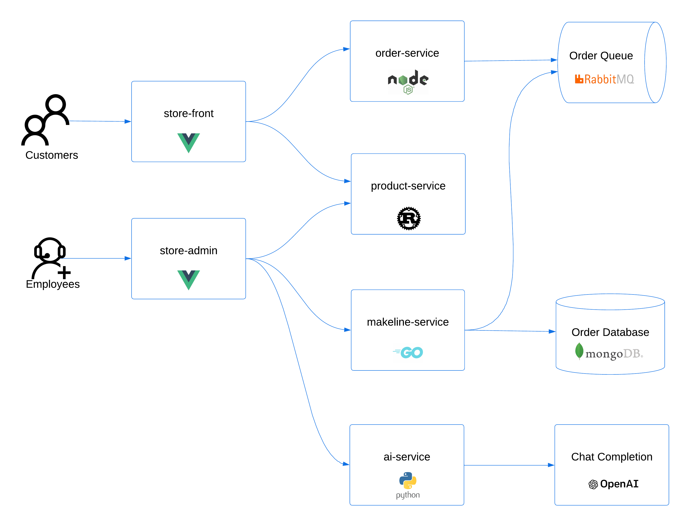
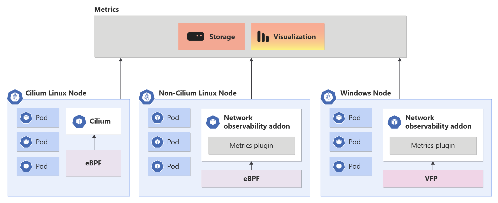
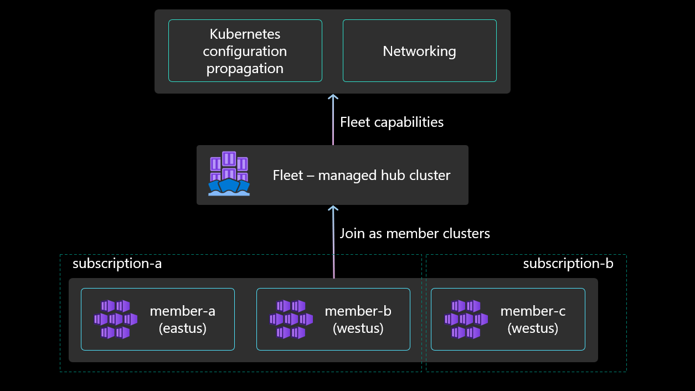
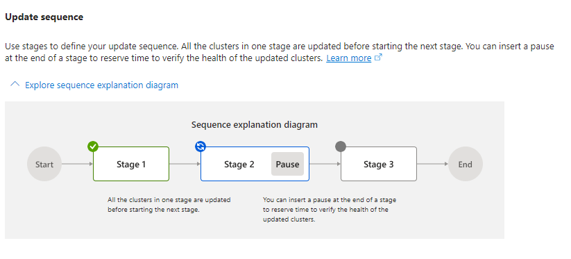

# AKSDeepDive-GA
Repo for the demo on Global Azure Portugal 2024

**Table Of Contents**

1. [Demo Objectives](#1-learning-objectives)
2. [Pre-Requisites](#2-pre-requisites)
    - 2.1 [Create Azure Resources](#21-create-azure-resources)
3. [Manual Setup Environment ](#3-manual-setup-environment)
    - 3.1 [Login into the cluster](#31-login-into-the-cluster)
    - 3.2 [Enable cost analysis addon on the AKS cluster](#32-enable-cost-analysis-addon-on-the-aks-cluster)
    - 3.3 [Update the AKS cluster from Azure CNI plugin to Azure CNI Overlay](#33-update-the-aks-cluster-from-azure-cni-plugin-to-azure-cni-overlay)
4. [Installing unmanaged community nginx ingress controller](#4-installing-unmanaged-community-nginx-ingress-controller)
5. [Deploy the Application - AKS Store Demo](#5-deploy-the-application---aks-store-demo)
6. [Enable Istio addon](#6-enable-istio-addon)
    - 6.1 [Expose the store-front service via Istio ingress gateway - public gateway](#61-expose-the-store-front-service-via-istio-ingress-gateway---public-gateway)
7. [Expose the store-admin service via app-routing addon](#7-expose-the-store-admin-service-via-app-routing-addon)
    - 7.1 [Set up a custom domain name and SSL certificate with the app routing add-on](#71-set-up-a-custom-domain-name-and-ssl-certificate-with-the-app-routing-add-on)
    - 7.2 [Create the Ingress that uses a custom domain name hosted as an Azure DNS zone](#72-create-the-ingress-that-uses-a-custom-domain-name-hosted-as-an-azure-dns-zone)
    - 7.3 [Add to hosts file the subdomain](#73-add-to-hosts-file-the-subdomain)
8. [Enable Monitoring into the cluster via managed Prometheus & Grafana](#8-enable-monitoring-into-the-cluster-via-managed-prometheus--grafana)
    - 8.1 [Enable Network Observability](#81-enable-network-observability)
9. [Deploy the AI service connected to azure openai with keyvault to store the secrets (Open AI api key) - using the Microsoft Entra Workload ID - workload identity method](#9-deploy-the-ai-service-connected-to-azure-openai-with-keyvault-to-store-the-secrets-open-ai-api-key---using-the-microsoft-entra-workload-id---workload-identity-method)
10. [Node autoprovisioning (preview) with karpenter dynamic cluster scaling](#10-node-autoprovisioning-preview-with-karpenter-dynamic-cluster-scaling)
11. [AKS Fleet Manager - manage at scale](#11-aks-fleet-manager---manage-at-scale)
    - 11.1 [Create a fleet with a hub cluster (enables workload propagation and multi-cluster load balancing)](#111-create-a-fleet-with-a-hub-cluster-enables-workload-propagation-and-multi-cluster-load-balancing)
    - 11.2 [Upgrade the members](#112-upgrade-the-members)


## 1. Learning Objectives
Deep Dive in AKS, to learn to deploy and configure a production ready AKS Cluster and prepare workloads to run on it with all the configurations needed for a proper lifecycle on AKS CLusters. 

## 2. Pre-Requisites
- **Azure Subscription** - [Signup for a free account.](https://azure.microsoft.com/free/)
- **Visual Studio Code** - [Download it for free.](https://code.visualstudio.com/download)
- **GitHub Account** - [Signup for a free account.](https://github.com/signup)
- **AKS Cluster** - [Learn about the Service.](https://azure.microsoft.com/en-us/products/kubernetes-service)
- **Azure Kubernetes Fleet Manager** - [Learn about the Service.](https://azure.microsoft.com/en-us/products/kubernetes-fleet-manager)
- **Key Vault and Container Registry** - Required for the Demo 

### 2.1. Create Azure resources

We setup our development environment in the previous step. In this step, we'll **provision Azure resources** for our demo, ready to use.
- AKS (Azure Kubernetes Services) - CNI Overlay Network Plugin & Standard API
- Azure Key Vault - Store secrets and certificates
- Azure Kubernetes Fleet Manager - Manage multiple AKS clusters
- AKS (Azure Kubernetes Services) - Cilium Network Data Plane & CNI Overlay Network Plugin

## 3. Manual Setup Environment

Please check the [pre-requisites](pre-requisites.md) file for the setup of the environment.


### 3.1. Login into the cluster
```bash
#login into the AKS Cluster
az account set --subscription $SUBSCRIPTION_ID
az aks get-credentials --resource-group $RESOURCE_GROUP --name $CLUSTER --overwrite-existing
```

### 3.2. Enable cost analysis addon on the AKS cluster
```bash
# enable cost analysis on the cluster - only possible with Standard API mode
az aks update --resource-group $RESOURCE_GROUP --name $CLUSTER --enable-cost-analysis
```

### 3.3. Update the AKS cluster from Azure CNI plugin to Azure CNI Overlay

Before doing this task, please read the [documentation](https://learn.microsoft.com/en-us/azure/aks/azure-cni-overlay?tabs=kubectl#upgrade-an-existing-cluster-to-cni-overlay) regarding the limitations and criteria for this operation.

```bash
# update the cluster to use the overlay network plugin
az aks update --name $CLUSTER --resource-group $RESOURCE_GROUP --network-plugin-mode overlay --pod-cidr 192.168.0.0/16
```

## 4. Installing unmanaged community nginx ingress controller

#### What is an ingress?
In Kubernetes, an ingress is an API object that manages external access to services within a cluster. It acts as a traffic controller, routing incoming requests to the appropriate services based on rules defined in the ingress resource. It provides a way to expose HTTP and HTTPS routes to services, enabling external access to applications running in the cluster.

```bash
# install nginx ingress controller chart (https://github.com/kubernetes/ingress-nginx) 
helm install ingress-nginx ingress-nginx/ingress-nginx \
--create-namespace \
--namespace ingress-nginx \
--set controller.service.annotations."service\.beta\.kubernetes\.io/azure-load-balancer-health-probe-request-path"=/healthz \
--set controller.nodeSelector."kubernetes\.io/os"=linux \
--set controller.replicaCount=2 
#--set controller.service.loadBalancerIP="" 
#--set controller.nodeSelector.agentpool=
#--set controller.ingressClass=""
#--set controller.ingressClassResource.name=""
#--set controller.ingressClassResource.controllerValue="k8s.io/ingress-nginx"
```

## 5. Deploy the Application - AKS Store Demo 

**Github Repo:** [AKS Store Demo](https://github.com/Azure-Samples/aks-store-demo)

***Architecture:***




```bash	
# create the namespace where the demo app will be deployed
kubectl create ns aksappga
```

```bash
# deploy the app into the namespace
kubectl apply -f https://raw.githubusercontent.com/Azure-Samples/aks-store-demo/main/aks-store-all-in-one.yaml -n aksappga
```

```bash
# expose the store-front service via unmanaged nginx ingress controller
kubectl apply -f .\nginx-ingress.yaml
```

```bash
# get the public IP of the ingress controller
kubectl get svc ingress-nginx-controller -n ingress-nginx -o jsonpath='{.status.loadBalancer.ingress[0].ip}'
```

```bash	
# curl the store-front service
curl http://<ingress-ip>
```

## 6. Enable Istio addon 

```bash
# enable the addon on the cluster (already enabled via pre-requisites section)
az aks mesh get-revisions --location $LOCATION -o table
```

```bash
az aks mesh enable --resource-group $RESOURCE_GROUP --name $CLUSTER
```

```bash
# check the profiles of the addon
az aks show --resource-group $RESOURCE_GROUP --name $CLUSTER  --query 'serviceMeshProfile.mode'
```

```bash
# label the demo namespace with the previously enabled Istio revision 
kubectl label namespace aksappga istio.io/rev=asm-1-20
```

```bash	
### if needed restart the demo app for assume the Istio sidecar
kubectl rollout restart deployment <deployment name> -n <deployment namespace>
```

### 6.1. Expose the store-front service via Istio ingress gateway - public gateway

```bash
# enable external ingress gateway for the mesh
az aks mesh enable-ingress-gateway --resource-group $RESOURCE_GROUP --name $CLUSTER --ingress-gateway-type external
```

```bash
# apply the gateway configuration
kubectl apply -f .\gateway.yaml
```

```bash
# get the gateway IP 
kubectl get svc aks-istio-ingressgateway-external -n aks-istio-ingress -o jsonpath='{.status.loadBalancer.ingress[0].ip}'
```

```bash
# curl the store-front service via the Istio gateway
curl http://<gateway-ip>
```

## 7. Expose the store-admin service via app-routing addon 

The application routing add-on with NGINX delivers the following:

- Easy configuration of managed NGINX Ingress controllers based on Kubernetes NGINX Ingress controller.
- Integration with Azure DNS for public and private zone management
- SSL termination with certificates stored in Azure Key Vault.
- The add-on runs the [application routing operator](https://github.com/Azure/aks-app-routing-operator)


***Note:*** It supports already internal ingress (LB) mode - https://learn.microsoft.com/en-us/azure/aks/app-routing-nginx-configuration#create-an-internal-nginx-ingress-controller-with-a-private-ip-address)

```bash
# enable the app-routing addon on the cluster (already enabled via pre-requisites section)
az aks approuting enable -g $RESOURCE_GROUP -n $CLUSTER
```

```bash	
# create the app-routing-ingress yaml definition
kubectl apply -f .\app-routing-ingress.yaml
```

```bash	
# get the public IP of the app-routing addon
kubectl get svc nginx -n app-routing-system -o jsonpath='{.status.loadBalancer.ingress[0].ip}'
```

```bash	
# curl the store-admin service via the app-routing addon
curl http://<app-routing-ip>
```

### 7.1 Set up a custom domain name and SSL certificate with the app routing add-on 

**NOTE:** we can step to 7.2 section, since already performed on pre-requisites section)

On this section we will use the Azure Key Vault integration with the app-routing addon to store the SSL certificate and use it to expose the store-front service via the app-routing addon with a custom domain name.

#### Terminate HTTPS traffic with certificates from Azure Key Vault

The application routing add-on can be integrated with Azure Key Vault to retrieve SSL certificates to use with ingresses.

#### Create and export a self-signed SSL certificate

For testing, you can use a self-signed public certificate instead of a Certificate Authority (CA)-signed certificate. Create a self-signed SSL certificate to use with the Ingress using the openssl req command. Make sure you replace with the DNS name you're using.

```bash
# create a self signed certificate (already created via pre-requisites section)
openssl req -new -x509 -nodes -out aks-ingress-tls.crt -keyout aks-ingress-tls.key -subj "/CN=store-front.globalazuredemomsft.com" -addext "subjectAltName=DNS:store-front.globalazuredemomsft.com"
```	
```bash
openssl pkcs12 -export -in aks-ingress-tls.crt -inkey aks-ingress-tls.key -out aks-ingress-tls.pfx
```
```bash
# import the certificate into azure key vault
az keyvault certificate import --vault-name $VAULT_NAME -n aks-ingress-tls -f aks-ingress-tls.pfx 
```


#### Enable Azure Key Vault integration
```bash	
# enable azure key vault integration (this will enable secretcsi provider if not already enabled)
az keyvault show --name $VAULT_NAME --query "id" --output tsv
```

```bash	
# update the app-routing addon on cluster to use the key vault
az aks approuting update -g $RESOURCE_GROUP -n $CLUSTER --enable-kv --attach-kv /subscriptions/$SUBSCRIPTION_ID/resourceGroups/$RESOURCE_GROUP/providers/Microsoft.KeyVault/vaults/$VAULT_NAME
```

```bash	
### attach dns zone to app routing
az network dns zone show -g $RESOURCE_GROUP -n $DNS_ZONE --query "id" --output tsv
```

```bash	
az aks approuting zone add -g $RESOURCE_GROUP -n $CLUSTER --ids=/subscriptions/$SUBSCRIPTION_ID/resourceGroups/$RESOURCE_GROUP/providers/Microsoft.Network/dnszones/$DNS_ZONE --attach-zones
```	

### 7.2. Create the Ingress that uses a custom domain name hosted as an Azure DNS zone 

#### Retrieve the certificate URI from Azure Key Vault
Get the certificate URI to use in the Ingress from Azure Key Vault using the az keyvault certificate show command.

```bash
# retrieve the certificate uri from the key vault needed for the ingress definition
az keyvault certificate show --vault-name  $VAULT_NAME -n aks-ingress-tls --query "id" --output tsv
```


#### Update the ingress object to use a hostname

Update the file ingress.yaml with the following contents. Replace <ZoneName> with a name of the zone you created earlier and <KeyVaultCertificateUri> with the certificate URI. You can ommit the version of the certificate and just use that portion https://KeyVaultName.vault.azure.net/certificates/KeyVaultCertificateName.

#### Apply the modified ingress

```bash
#copy the uri to the app-routing-ingress-tls.yaml file and apply it
kubectl apply -f .\app-routing-ingress-tls.yaml  
```

We can then check the secret being created on AKS.

##### Verify that the Azure DNS has been reconfigured with a new A record

In a few minutes, the Azure DNS zone will be reconfigured with a new A record pointing to the IP address of the NGINX ingress controller.

```bash
az network dns record-set a list -g $RESOURCE_GROUP -z $DNS_ZONE
```

The following example output shows the created record:

```bash
[
  {
    "aRecords": [
      {
        "ipv4Address": "20.51.92.19"
      }
    ],
    "etag": "188f0ce5-90e3-49e6-a479-9e4053f21965",
    "fqdn": "helloworld.contoso.com.",
    "id": "/subscriptions/xxxxxxx-xxxx-xxxx-xxxx-xxxxxxxxxx/resourceGroups/foo/providers/Microsoft.Network/dDnsZones/contoso.com/A/helloworld",
    "isAutoRegistered": false,
    "name": "helloworld",
    "resourceGroup": "foo",
    "ttl": 300,
    "type": "Microsoft.Network/dnsZones/A"
  }
]
```

If this Azure DNS zone is configured to resolve to an actual public domain that you purchased and you've configured its top level nameservers, you should be able to use your browser to access the hostname.

### 7.3 Add to hosts file the subdomain

Add to the the local hosts file, the subdomain name store-front.globalazuredemomsft.com pointing to the app-routing ip and then we can hit [on browser](https://store-front.globalazuredemomsft.com/) and check the store-admin service with th self signed certificate and exposed via tls using the app-routing addon.


## 8. Enable Monitoring into the cluster via managed Prometheus & Grafana 

In this section we will enable the monitoring addon on the AKS cluster, enabling the managed prometheus and check the metrics on the managed grafana dashboard.

[Learn about on documentation ](https://techcommunity.microsoft.com/t5/azure-observability-blog/comprehensive-network-observability-for-aks-through-azure/ba-p/3825852)

```bash
# create azure monitor resource (already created via pre-requisites section)
az resource create --resource-group $RESOURCE_GROUP --namespace microsoft.monitor --resource-type accounts --name globalazuremonitor --location $LOCATION --properties '{}'
```

```bash	
# create grafana instance (already created via pre-requisites section)
az grafana create --name globalazuregf --resource-group $RESOURCE_GROUP 
```

```bash	
# place grafana and monitor id into variables
grafanaId=$(az grafana show --name globalazuregf --resource-group $RESOURCE_GROUP --query id --output tsv)
azuremonitorId=$(az resource show --resource-group $RESOURCE_GROUP --name globalazuremonitor --resource-type "Microsoft.Monitor/accounts" --query id --output tsv)
```

```bash	
# link monitor and grafana to AKS cluster
az aks update --name $CLUSTER --resource-group $RESOURCE_GROUP --enable-azure-monitor-metrics --azure-monitor-workspace-resource-id $azuremonitorId --grafana-resource-id $grafanaId
```

```bash	
## see if the ama pods are running
kubectl get po -owide -n kube-system | grep ama-
```	

### 8.1. Enable Network Observability 

[Network observability] (https://learn.microsoft.com/en-us/azure/aks/network-observability-managed-cli?tabs=non-cilium) is an important part of maintaining a healthy and performant Kubernetes cluster. By collecting and analyzing data about network traffic, you can gain insights into how your cluster is operating and identify potential problems before they cause outages or performance degradation.



```bash 
# enable network observability on the cluster
az aks update --resource-group $RESOURCE_GROUP --name $CLUSTER --enable-network-observability
```


Learn more about Retina (https://azure.microsoft.com/en-us/blog/microsoft-open-sources-retina-a-cloud-native-container-networking-observability-platform/)

[Retina webpage](https://retina.sh/)


Learn more about [control plane metrics](https://learn.microsoft.com/en-us/azure/aks/monitor-control-plane-metrics) with API server and etcd metrics Grafana dashboards integration.


## 9. Deploy the AI service connected to azure openai with keyvault to store the secrets (Open AI api key) - using the Microsoft Entra Workload ID - workload identity method

A Microsoft Entra Workload ID is an identity that an application running on a pod uses to authenticate itself against other Azure services, such as workloads in software. The Secret Store CSI Driver integrates with native Kubernetes capabilities to federate with external identity providers.

In this security model, the AKS cluster acts as token issuer. Microsoft Entra ID then uses OIDC to discover public signing keys and verify the authenticity of the service account token before exchanging it for a Microsoft Entra token. For your workload to exchange a service account token projected to its volume for a Microsoft Entra token, you need the Azure Identity client library in the Azure SDK or the Microsoft Authentication Library (MSAL)

Learn more about [workload identity](https://learn.microsoft.com/en-us/azure/aks/csi-secrets-store-identity-access#access-with-a-microsoft-entra-workload-id)

Learn more about [csi secret store integration with AKS](https://learn.microsoft.com/en-us/azure/aks/csi-secrets-store-configuration-options#set-an-environment-variable-to-reference-kubernetes-secrets)

After enabling the workload identity and the csi driver on the pre-requisites section, we can now deploy the AI service connected to the azure openai api with the keyvault to store the api keys and secrets.

```bash
# verify that csi secret provider is enabled
kubectl get pods -n kube-system -l 'app in (secrets-store-csi-driver,secrets-store-provider-azure)'
```

```bash	
# create the identity for the workload identity (already created)
export UAMI=wiglobalazurepmsi
```

```bash	
# create te identity (already created)
az identity create --name $UAMI --resource-group $RESOURCE_GROUP
```

```bash	
export USER_ASSIGNED_CLIENT_ID="$(az identity show -g $RESOURCE_GROUP --name $UAMI --query 'clientId' -o tsv)"
export IDENTITY_TENANT=$(az aks show --name $CLUSTER --resource-group $RESOURCE_GROUP --query identity.tenantId -o tsv)
export KEYVAULT_SCOPE=$(az keyvault show --name $VAULT_NAME --query id -o tsv)
```

```bash	
# create the role assignment for the identity to access the key vault (already created)
az role assignment create --role "Key Vault Administrator" --assignee $USER_ASSIGNED_CLIENT_ID --scope $KEYVAULT_SCOPE
```

```bash	
export AKS_OIDC_ISSUER="$(az aks show --resource-group $RESOURCE_GROUP --name $CLUSTER --query "oidcIssuerProfile.issuerUrl" -o tsv)"
echo $AKS_OIDC_ISSUER
export SERVICE_ACCOUNT_NAME="workload-identity-sa"  
export SERVICE_ACCOUNT_NAMESPACE="aksappga" 
```

```bash	
# create the service account with the workload identity annotation clientID
cat <<EOF | kubectl apply -f -
apiVersion: v1
kind: ServiceAccount
metadata:
  annotations:
    azure.workload.identity/client-id: ${USER_ASSIGNED_CLIENT_ID}
  name: ${SERVICE_ACCOUNT_NAME}
  namespace: ${SERVICE_ACCOUNT_NAMESPACE}
EOF
```

```bash	
# create the federated identity for the workload identity
export FEDERATED_IDENTITY_NAME="aksglobalazurefederatedidentity"
```	

```bash	
# create the federated identity for the workload identity
az identity federated-credential create --name $FEDERATED_IDENTITY_NAME --identity-name $UAMI --resource-group $RESOURCE_GROUP --issuer ${AKS_OIDC_ISSUER} --subject system:serviceaccount:${SERVICE_ACCOUNT_NAMESPACE}:${SERVICE_ACCOUNT_NAME}
```

```bash	
# create the secret in the key vault
az keyvault secret set --vault-name $VAULT_NAME --name openaiapikey --value ""
```
```bash	
# create the secret provider class with the workload identity to access the key vault to retrieve the openai api key
cat <<EOF | kubectl apply -f -
apiVersion: secrets-store.csi.x-k8s.io/v1
kind: SecretProviderClass
metadata:
  name: globalazure-wi                     # needs to be unique per namespace
  namespace: aksappga
spec:
  provider: azure
  secretObjects:                           # [OPTIONAL] SecretObjects defines the desired state of synced Kubernetes secret objects
  - data:
    - key: keyopenai                       # data field to populate
      objectName: openaiapikey             # name of the mounted content to sync; this could be the object name or the object alias
    secretName: openaisecret               # name of the Kubernetes secret object
    type: Opaque       
  parameters:
    usePodIdentity: "false"
    clientID: "${USER_ASSIGNED_CLIENT_ID}" # Setting this to use workload identity
    keyvaultName: ${VAULT_NAME}         # Set to the name of your key vault
    cloudName: ""                          # [OPTIONAL for Azure] if not provided, the Azure environment defaults to AzurePublicCloud
    objects:  |
      array:
        - |
          objectName: openaiapikey        # Set to the name of your secret
          objectType: secret              # object types: secret, key, or cert
          objectVersion: ""               # [OPTIONAL] object versions, default to latest if empty
    tenantId: "${IDENTITY_TENANT}"        # The tenant ID of the key vault
EOF
```

#### Verifiy the secret provider class and the secret created

```bash
# verify the secret provider class created
kubectl get secretproviderclass -n aksappga
```

```bash	
# describe the secret provider class 
kubectl describe secretproviderclass globalazure-wi -n aksappga
```

```bash	
# verify the secret created
kubectl get secret openaisecret -n aksappga
```

```bash
# apply the ai-service deployment
kubectl apply -f ai-service-v2.yaml
```

```bash	
# check the env vars on pod, and confirm the openai api key is being retrieved from the key vault
kubectl -n aksappga exec -it <pod-name> -c ai-service -- /bin/sh
```

We can now test the store-admin integration with openai, by creating a product to inventory, and ask for help on the description generator powered by azure openai gpt-3.5-turbo model.

**Note:** We can configure on ai-service deployment the azure openai access also via [managed identity](https://learn.microsoft.com/en-us/azure/aks/open-ai-secure-access-quickstart) under the azure context.


## AKS Scaling

## 10. Node auto provisioning (preview) with karpenter dynamic cluster scaling

In this section we will enable the [node auto provisioning feature](https://learn.microsoft.com/en-us/azure/aks/node-autoprovision?tabs=azure-cli) on the AKS cluster, using the karpenter dynamic cluster scaling feature

**Limitations**
- The only network configuration allowed is Cilium + Overlay + Azure
- You can't enable in a cluster where node pools have cluster autoscaler enabled

```bash	
# create variables for the cilium cluster
export RESOURCE_GROUP_NAP=fleet-aks
export CLUSTER_NAP=aks-karp
```

```bash
#login into the AKS Cluster with cilium network data plane
az aks get-credentials --resource-group $RESOURCE_GROUP_NAP --name $CLUSTER_NAP --overwrite-existing
```

```bash	
# check the default node class to change the node sku and topology 
kubectl edit aksnodeclass default
```

Lets deploy an [application](https://github.com/wdhif/docker-stress-ng) that will create stress into the nodes to trigger the karpenter dynamic cluster scaling feature 

```bash
# check the karpenter events to see the scaling events
kubectl get events -A --field-selector source=karpenter -w
```

```bash	
# create a stress deployment to trigger the scaling
kubectl apply -f stress-deployment.yaml 
```

## 11. AKS Fleet Manager - manage at scale

In this section we will create an AKS Fleet Manager resource and onoboard new AKS clusters to the fleeet hub, in order to perform operations at scale like and upgrade or resource proliferation between multiple clusters.


[Azure Kubernetes Fleet Manager (Fleet)](https://learn.microsoft.com/en-us/azure/kubernetes-fleet/overview) enables at-scale management of multiple Azure Kubernetes Service (AKS) clusters. Fleet supports the following scenarios:

-  Create a Fleet resource and join AKS clusters across regions and subscriptions as member clusters.

- Orchestrate Kubernetes version upgrades and node image upgrades across multiple clusters by using update runs, stages, and groups.

- Create Kubernetes resource objects on the Fleet resource's hub cluster and control their propagation to member clusters (preview).

- Export and import services between member clusters, and load balance incoming layer-4 traffic across service endpoints on multiple clusters (preview).




## 11.1 Create a fleet with a hub cluster (enables workload propagation and multi-cluster load balancing)


```bash
# create variables for the fleet & member clusters 
export FLEET_GROUP=fleet-aks
export LOCATION=westeurope
export FLEET=fleetmgr-globalazure-demo
export MEMBER_NAME_3=globalazure-demo
export MEMBER_CLUSTER_ID_3=/subscriptions/fef74fbe-24ca-4d9a-ba8e-30a17e95608b/resourcegroups/GlobalAzureDemo/providers/Microsoft.ContainerService/managedClusters/globalazure-demo
```

```bash
# create the fleet resource with a hub cluster (already created)
az fleet create --resource-group $FLEET_GROUP --name $FLEET --location $LOCATION --enable-hub
```

```bash	
## Join the first member cluster
az fleet member create --resource-group $GROUP --fleet-name $FLEET --name $MEMBER_NAME_3 --update-group test --member-cluster-id $MEMBER_CLUSTER_ID_3
```

```bash	
## list members
az fleet member list --resource-group $GROUP --fleet-name $FLEET -o table
```


### 11.2. Upgrade the members 

Platform admins managing large number of clusters often have problems with staging the updates of multiple clusters (for example, upgrading node OS image versions, upgrading Kubernetes versions) in a safe and predictable way. To address this pain point, Azure Kubernetes Fleet Manager (Fleet) allows you to orchestrate updates across multiple clusters using update runs, stages, groups, and strategies.

[Learn more about at scale cluster upgrades] (https://learn.microsoft.com/en-us/azure/kubernetes-fleet/update-orchestration?tabs=cli)

We can use both Azure portal or azure cli

**Update clusters in a specific order**


```bash
# upgrade all memebers at once
az fleet updaterun create --resource-group $GROUP --fleet-name $FLEET --name run-1 --upgrade-type Full --kubernetes-version 1.29.0
```


```bash
#https://learn.microsoft.com/en-us/azure/kubernetes-fleet/update-orchestration?tabs=cli#update-clusters-in-a-specific-order
az fleet updaterun create --resource-group $GROUP --fleet-name $FLEET --name run-3 --upgrade-type Full --kubernetes-version 1.26.0 --stages example-stages.json
```

```bash	
Here's an example of input from the stages file (example-stages.json):

{
    "stages": [
        {
            "name": "stage1",
            "groups": [
                {
                    "name": "group-1a"
                },
                {
                    "name": "group-1b"
                },
                {
                    "name": "group-1c"
                }
            ],
            "afterStageWaitInSeconds": 3600
        },
        {
            "name": "stage2",
            "groups": [
                {
                    "name": "group-2a"
                },
                {
                    "name": "group-2b"
                },
                {
                    "name": "group-2c"
                }
            ]
        }
    ]
}
```

***extra arguments***

- --upgrade-type NodeImageOnly


